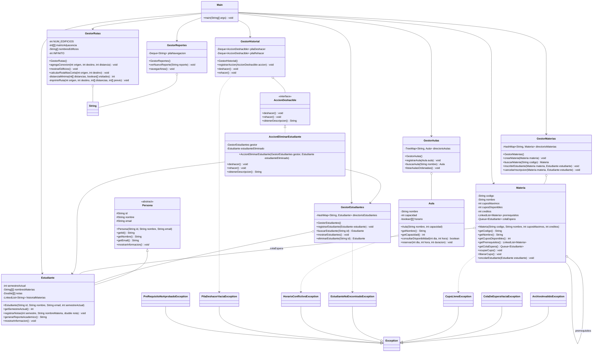

# Estructura-de-datos

```mermaid
classDiagram

class Main {
  +main(String[] args) void
}

class Persona {
  <<abstract>>
  #String id
  #String nombre
  #String email
  +Persona(String id, String nombre, String email)
  +getId() String
  +getNombre() String
  +getEmail() String
  +mostrarInformacion()* void
}

class Estudiante {
  -int semestreActual
  -String[][] nombresMaterias
  -Double[][] notas
  -LinkedList~String~ historialMaterias
  +Estudiante(String id, String nombre, String email, int semestreActual)
  +getSemestreActual() int
  +registrarNotas(int semestre, String nombreMateria, double nota) void
  +generarReporteAcademico() String
  +mostrarInformacion() void
}

class Aula {
  -String nombre
  -int capacidad
  -boolean[][] horario
  +Aula(String nombre, int capacidad)
  +getNombre() String
  +getCapacidad() int
  +consultarDisponibilidad(int dia, int hora) boolean
  +reservar(int dia, int hora, int duracion) void
}

class Materia {
  -String codigo
  -String nombre
  -int cuposMaximos
  -int cuposDisponibles
  -int creditos
  -LinkedList~Materia~ prerrequisitos
  -Queue~Estudiante~ colaEspera
  +Materia(String codigo, String nombre, int cuposMaximos, int creditos)
  +getCodigo() String
  +getNombre() String
  +getCuposDisponibles() int
  +getPrerrequisitos() LinkedList~Materia~
  +getColaEspera() Queue~Estudiante~
  +ocuparCupo() void
  +liberarCupo() void
  +encolarEstudiante(Estudiante estudiante) void
}

class AccionDeshacible {
  <<interface>>
  +deshacer() void
  +rehacer() void
  +obtenerDescripcion() String
}

class AccionEliminarEstudiante {
  -GestorEstudiantes gestor
  -Estudiante estudianteEliminado
  +AccionEliminarEstudiante(GestorEstudiantes gestor, Estudiante estudianteEliminado)
  +deshacer() void
  +rehacer() void
  +obtenerDescripcion() String
}

class GestorEstudiantes {
  -HashMap~String, Estudiante~ directorioEstudiantes
  +GestorEstudiantes()
  +registrarEstudiante(Estudiante estudiante) void
  +buscarEstudiante(String id) Estudiante
  +mostrarEstudiantes() void
  +eliminarEstudiante(String id) Estudiante
}

class GestorMaterias {
  -HashMap~String, Materia~ directorioMaterias
  +GestorMaterias()
  +crearMateria(Materia materia) void
  +buscarMateria(String codigo) Materia
  +inscribirEstudiante(Materia materia, Estudiante estudiante) void
  +cancelarInscripcion(Materia materia, Estudiante estudiante) void
}

class GestorAulas {
  -TreeMap~String, Aula~ directorioAulas
  +GestorAulas()
  +registrarAula(Aula aula) void
  +buscarAula(String nombre) Aula
  +listarAulasOrdenadas() void
}

class GestorHistorial {
  -Deque~AccionDeshacible~ pilaDeshacer
  -Deque~AccionDeshacible~ pilaRehacer
  +GestorHistorial()
  +registrarAccion(AccionDeshacible accion) void
  +deshacer() void
  +rehacer() void
}

class GestorReportes {
  -Deque~String~ pilaNavegacion
  +GestorReportes()
  +verNuevoReporte(String reporte) void
  +navegarAtras() void
}

class GestorRutas {
  -int NUM_EDIFICIOS
  -int[][] matrizAdyacencia
  -String[] nombresEdificios
  -int INFINITO
  +GestorRutas()
  +agregaConexion(int origen, int destino, int distancia) void
  +mostrarEdificios() void
  +calcularRutaMasCorta(int origen, int destino) void
  -distanciaMinima(int[] distancias, boolean[] visitados) int
  -imprimirRuta(int origen, int destino, int[] distancias, int[] previo) void
}

class ArchivoInvalidoException
class ColaDeEsperaVaciaException
class CupoLlenoException
class EstudianteNoEncontradoException
class HorarioConflictivoException
class PilaDeshacerVaciaException
class PreRequisitoNoAprobadoException

Persona <|-- Estudiante

AccionDeshacible <|.. AccionEliminarEstudiante

GestorEstudiantes o-- Estudiante
GestorMaterias o-- Materia
GestorAulas o-- Aula
GestorHistorial o-- AccionDeshacible
GestorReportes o-- String
GestorRutas o-- String

Materia o-- Estudiante : colaEspera
Materia o-- Materia : prerrequisitos

AccionEliminarEstudiante --> GestorEstudiantes
AccionEliminarEstudiante --> Estudiante

Main --> GestorEstudiantes
Main --> GestorAulas
Main --> GestorRutas
Main --> GestorHistorial
Main --> GestorReportes
Main --> GestorMaterias
Main --> Estudiante
Main --> Materia

Aula ..> HorarioConflictivoException
Materia ..> CupoLlenoException
GestorEstudiantes ..> EstudianteNoEncontradoException
GestorHistorial ..> PilaDeshacerVaciaException

ArchivoInvalidoException --|> Exception
ColaDeEsperaVaciaException --|> Exception
CupoLlenoException --|> Exception
EstudianteNoEncontradoException --|> Exception
HorarioConflictivoException --|> Exception
PilaDeshacerVaciaException --|> Exception
PreRequisitoNoAprobadoException --|> Exception
```